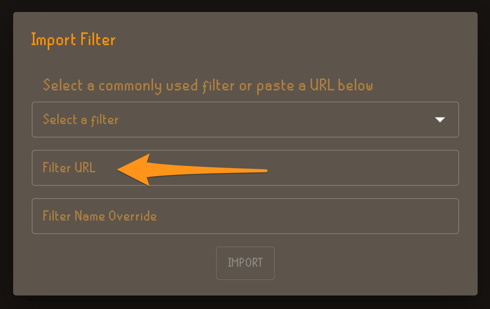
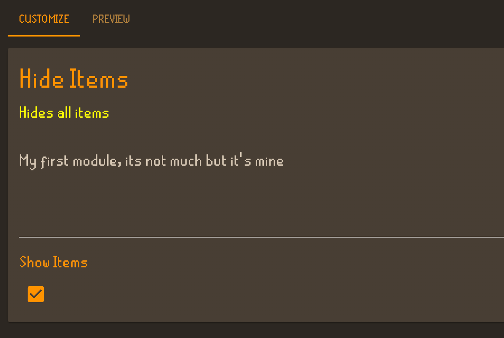

# Chatper 1: Getting started with modular filters

Modular filters are an extension of the filter framework provided by the loot-filters plugin that allow you to build, share and configure filters via the loot-filters UI.

These docs will walk you through from never having done any development, programming or configured a filter before, to having a complete filter that you can use and extend as you like.

## 1.1: GitHub

The best way to store and share your filters is on [GitHub](http://github.com) they host files for free, and they have a lot of tools that we'll be using throughout this tutorial. If you don't have an account go make one now.

## 1.2: Create a repository

You can follow [GitHub's docs](https://docs.github.com/en/repositories/creating-and-managing-repositories/quickstart-for-repositories) on this. They've got nice screenshots etc. and will update their own docs if anything changes in their UI.

## 1.3: Clone the repository

If you're not familiar with `git`, it's a "Version Control System" if you want to know what that means, or generally want to know more about `git`, check out [https://git-scm.com](https://git-scm.com/book/en/v2). Its a digital book in tons of different languages that cover way more than you'll ever want to know.

If you've never used git before, you should use [GitHub Desktop](https://desktop.github.com/download/). It will make everything easier since it's made by GitHub for interacting with their website, and you can continue to rely on their docs if you get stuck on anything. You can clone directly into GitHub desktop from the browser with this option:


## 1.4: Editors

You can edit your files with whatever tool you're comfortable with. For the purposes of this tutorial we're going to use [VS Code](https://code.visualstudio.com/).

With VS Code installed; go to `File` > `Open Folder` and open up the folder for your project.

Now you're ready for Chapter 2.

# Chapter 2: Creating a Filter

In this chapter we're going to go from 0 filter - to something you can actually import into the loot-filters UI.

## 2.1 Filter Json

[JSON](https://en.wikipedia.org/wiki/JSON) or `JavaScript Object Notation` is a way to structure data. It's the format we'll be using to configure the modular parts of our filter. The first `json` file we're going to need will be a file for our filter definition. Lets
call it `filter.json`. The file should contain a json object with 3 fields `name` for the name of our filter, `description` a short description of your filter, and `modules` which will be a list of our modules. For now we'll just leave it as an empty list `[]`

```json
{
    "name": "My Filter",
    "description": "My first filter",
    "modules": []
}
```

That's it - you now, in the most technical sense, do have a 'modular filter'. It has no modules so it won't do anything. But it does exist. Lets save it, and push it up to GitHub.

## 2.2 GitHub, branches

In industry, software development shops we push our changes to a `branch`, which then is compared with the `main` branch. Our co-workers then review the changes, leave comments and eventually our changes are `merged` with the main branch.

Since this filter is just an example, and only 1 person is working on it we're going to dispense with all of that. We'll just operate off the 1 branch we have `main`.

GitHub desktop will show you the changes you've made, deleted lines will be red, new lines will be green. In this case we deleted no lines and created 5, so we'll have an all-green file with the json text above in it. GitHub has [documentation](https://docs.github.com/en/desktop/making-changes-in-a-branch/committing-and-reviewing-changes-to-your-project-in-github-desktop) for committing and pushing your changes.

If prompted to commit or push your changes to another branch; skip that we don't need to in this case. Once you've committed in the top right there should be an option to `push` your changes from your computer into the cloud. Once you've done that you can visit your repository and see your new file there.

## 2.3 Loading your filter for the first time

Now that we have our file in the cloud we can load our filter in the UI. Browse to GitHub and open your file:


Then with your file open; navigate to the 'raw' view of your file:


Copy the URL for this page and go to the [Loot Filters UI](https://loot-filters.kaqemeex.net/). Click the button to import a filter,
and instead of choosing from the dropdown, paste your URL into the URL input:


Now hit Import and your filter should load. As we said before, there are no modules so you can't do much in the UI at this point.
But if all the steps have been followed correctly the filter should load, and be available in the `select a filter` dropdown.

# Chapter 3: Adding a module

In this chapter we're going to create and add our first module. It won't be super useful, but it will serve as a starting point for future modules we want to add. Like with the filter we'll end by importing it into the UI and being able to see our progress.

## 3.1 Moudle JSON

In the modular filter system modules have 2 parts. First, an json file which defines which UI inputs we'll be able to configure, and a second `rs2f` file with the actual filter configuration in it. Lets start with the JSON. Add a new file called `my_module.json`.
In that file put the following json structure.

```json
{
    "name": "Hide Items",
    "subtitle": "Hides all items",
    "description": "My first module, its not much but it's mine",
    "rs2f": { "path": "./my_module.rs2f" },
    "inputs": [
        {
            "type": "boolean",
            "macroName": "VAR_SHOW_ITEMS",
            "label": "Show Items",
            "default": true
        }
    ]
}
```

Every module has a few common parts, a `name` (required), a `subtitle` (optional), and a `descripton` (optional). These are used in the UI to give some context for a user as to what the moudule does. Then we have `inputs` this is where the magic happens. Each input we define in this list will create an interactable UI component that allows us to control the resulting filter code. In this case we have a `boolean` input which is a simple true / false configuration. In the UI this renders as a checkbox. It will render with the `label` we provide, and the default value will be whatever we put in `default`. We'll cover the `rs2f` in the next section.

The `macroName` field is how the UI transfers this over to the rs2f filter, so lets dive into that next, we'll cover the choice of `VAR_SHOW_ITEMS` in the next section.

## 3.2 RS2F

Looping back to the `rs2f` field in the module json. `"rs2f": { "path": "./my_module.rs2f" }` this is how we tell the UI to find the `rs2f` file. In this case we're telling the UI that the `rs2f` file exists at a path relative (the `./` bit) to the `my_module.json` that was loaded, at a file named `my_module.rs2f`.

Before we dive into the RS2F file content, if at any point you're confused about some syntax consult the [complete reference](https://github.com/riktenx/loot-filters/blob/userguide/filter-lang.md) which covers all the various features of the language.

Here's the RS2F snippet we'll pair with the above module, put it in `my_module.rs2f`:

```cpp
#define VAR_SHOW_ITEMS
hidden=VAR_SHOW_ITEMS;
```

Breaking things down, lets start with the first line, `#define VAR_SHOW_ITEMS`.

`#define` is a rs2f feature that creates a [macro](https://github.com/riktenx/loot-filters/blob/userguide/filter-lang.md#macros). A macro is a way for us to store something in one place, but re-use it in one or more other places. The module system takes advantage of this and uses macros as the connection point between the UI and the filter.

We define one macro per input, and then the UI populates them when you download the filter. This allows the UI to avoid doing anything complicated with your filter code, it just updates the macro definitions. If you look at the linked macro documentation you'll see that macros take 2 arguments an `identifier` our `VAR_SHOW_ITEMS` and a definition which we've left blank. Why did we leave it blank? Beacuse the UI will be creating the definition part for us, it's why we told it about the macro name in the input configuration.

The second line is `hidden=VAR_SHOW_ITEMS;` this line uses our macro to take the configuration provided by the UI, either `true` or `false` and pass it to the `hidden` property. Because we have no other conditions in this filter this will either hide all items, or show all items, depending on the configured value for our macro.

## 3.3 Adding our module to our filter

Now we need to update our filter to tell it about our moudle, we'll use the same relative path stuff to avoid having lots of things to update as we go. The new `filter.json` should be:

```json
{
    "name": "My Filter",
    "description": "My first filter",
    "modules": [{ "path": "./my_moudle.json" }]
}
```

With all of that done you can commit & push like we did in step 2.3. Grab the new raw URL for the updated `filter.json` paste that into the import section in the UI and you should see something like this be loaded up:



Congratulations! You've built your first modular filter. From here it is all about applying the principals and patterns outlined in the first 3 chapters, to different kinds of inputs and RS2F configuration. Chapter 4 will go over each of the inputs, their configuration and how to use them. Chapter 5 will cover useful RS2F patterns or 'recipies' for getting certain kinds of results.
